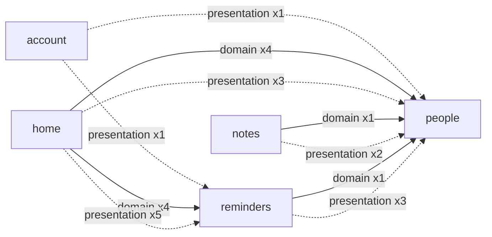

# Feature dependency graph

> Generated by `python3 tool/generate_dependency_graph.py --write`.
> Do not hand-edit the edge lists below; fix the imports, re-run,
> and commit the regenerated file.

Direction: `A --> B` means a file in feature A imports a file
from feature B. `domain` edges originate in `domain/` or
`application/` (business logic); `presentation` edges originate
in `presentation/` or the feature-local `data/` glue.

## Edges

### `account` → `people` (presentation, 1 imports)

- `account/presentation/cubit/account_cubit.dart`

### `account` → `reminders` (presentation, 1 imports)

- `account/presentation/cubit/notification_settings_cubit.dart`

### `home` → `people` (domain, 4 imports)

- `home/domain/entities/home_entity.dart`
- `home/domain/usecase/get_home_data_usecase.dart`
- `home/domain/usecase/has_reminders_usecase.dart`

### `home` → `people` (presentation, 3 imports)

- `home/presentation/views/widgets/home_circle_widget.dart`
- `home/presentation/views/widgets/home_success_header_widget.dart`

### `home` → `reminders` (domain, 4 imports)

- `home/domain/entities/home_entity.dart`
- `home/domain/usecase/get_home_data_usecase.dart`
- `home/domain/usecase/has_reminders_usecase.dart`

### `home` → `reminders` (presentation, 5 imports)

- `home/presentation/views/widgets/home_reminder_tile_widget.dart`
- `home/presentation/views/widgets/home_upcoming_reminders_widget.dart`

### `notes` → `people` (domain, 1 imports)

- `notes/domain/usecase/get_notes_usecase.dart`

### `notes` → `people` (presentation, 2 imports)

- `notes/presentation/cubit/notes_cubit.dart`
- `notes/presentation/views/notes_view.dart`

### `reminders` → `people` (domain, 1 imports)

- `reminders/domain/usecase/get_reminder_usecase.dart`

### `reminders` → `people` (presentation, 3 imports)

- `reminders/presentation/cubit/create_reminder_cubit.dart`
- `reminders/presentation/cubit/reminders_cubit.dart`
- `reminders/presentation/widgets/reminders_header_widget.dart`

## Target layering (ADR-0006)

- `people` is the shared kernel: family/identity entities and
  `PeopleRepository`. Other features depend on its **domain** only.
- `reminders` exposes reminder entities + `ReminderRepository`;
  `home` aggregates both into `HomeEntity` (domain-to-domain).
- No feature imports another feature's `data/` (Supabase stays
  behind the repository interface) or another feature's
  `presentation/` widgets except the shared `FamilyHeaderWidget`
  (explicit public UI surface, listed below until it moves to
  `core/widgets/` in Phase 2).
- Presentation cross-imports of `FamilyHeaderWidget`:
  - `home/presentation/views/widgets/home_success_header_widget.dart`
  - `notes/presentation/views/notes_view.dart`
  - `reminders/presentation/widgets/reminders_header_widget.dart`
